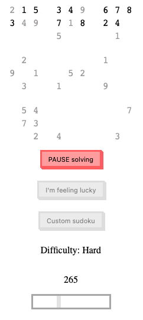

#Sudoku

##Solver for sudoku
    - It solves sudoku for you by force. It will try every possible compination
        1. It finds first possible solutions
        2. If sudoku has no sollution, the script will tell you

##Main goal
1. You can WATCH a script solve random sudoku from API
2. You can GIVE a script a entry, that it can then solve. If entry has no solution, the script will tell you.

##Structure
`sudoku.js` - main logic here. Sudoku{} object is constructed from sudoku vector [[],[],[],[],[],[],[],[],[]]
    - ####start solving
    ```javascript
    let sudokuVector = [[0,4,8,3,9,5,7,1,6],
    [5,7,1,6,2,8,3,4,9],[9,3,6,7,4,1,5,8,2],
    [6,8,2,5,3,9,1,7,4],[3,5,9,1,7,4,6,2,8],
    [7,1,4,8,6,2,9,5,3],[8,6,3,4,1,7,2,9,5],
    [1,9,5,2,8,6,4,3,7],[0,2,7,9,5,3,8,6,0]];
    let interval = 25; //interval in ms between each next test

    let S = new Sudoku(sudokuVector);
    
    S.StartSolving(interval);
    ```
    - ####implementing frontend
        - every interval a `S.Update()` method is called. The method can be override for an instance `S`.
        - at the end, methods `S.Solved()` or `S.Unsolved()` are called. The method can be override for an instance `S`.
        - you can also change the interval during running of the script by: 
        ```javascript
        let newInterval = 5;
        S.StopSolving();
        S.StartSolving(newInterval);
        ```
`fetch.js` - Dosuku API is called for random set of sudoku. Module returns object `{numbers, difficulty, solution}` 
    - `numbers` = sudoku vector
    - `difficulty` = string of dificulty
    - `solution` = sudoku vector for solution
`progress.js` - show from 0 to 1 how much close is the sudoku from solution
    - `Progress.setElement(HTML_node_element)` - `.value` of given element will be update
     `Progress.setSolution(solution)` - solution will be saved from sudoku vector
     `Progress.updateState(state)` - based on given state, update `.value` of given HTML node element
`customSudoku.js` - 
    - `CustomSudoku.create(HTML_element_node)` - inside given HTML element node (div wrapper for example) create sudoku grid. Every element is given its own function for changing number values
    - `CustomSudoku.getValue()` - get the state of created sudoku grid and `return` it as sudoku vector
`index.html`, `style.css` - frontend...


##images
